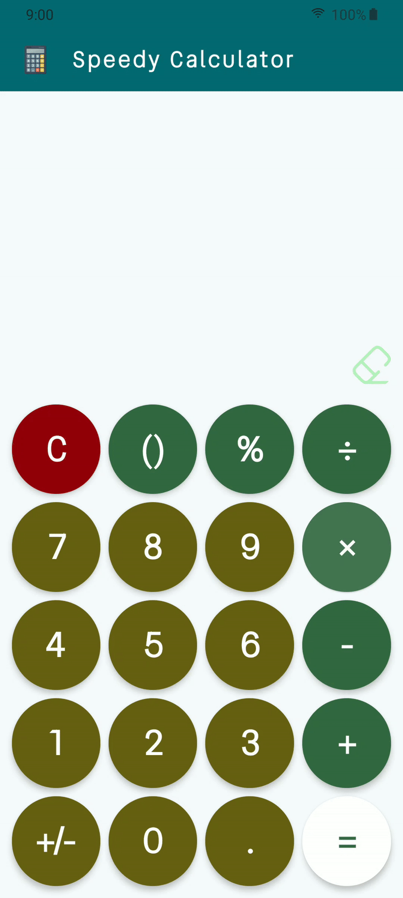
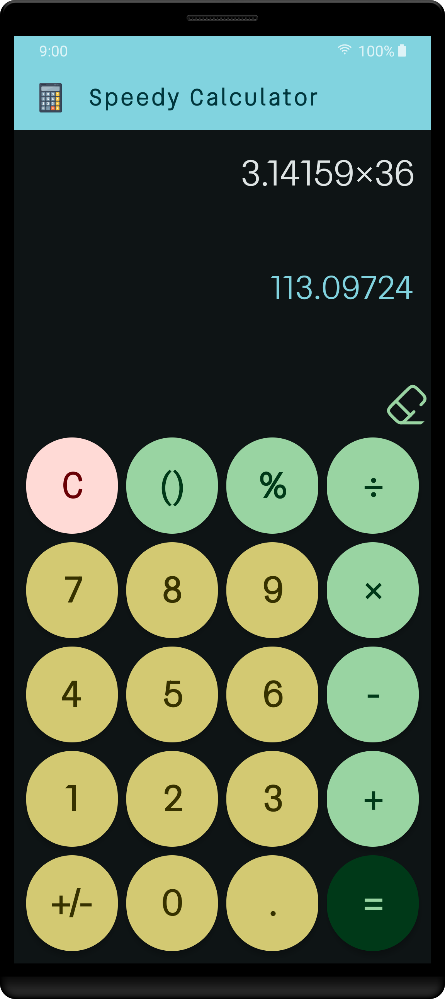
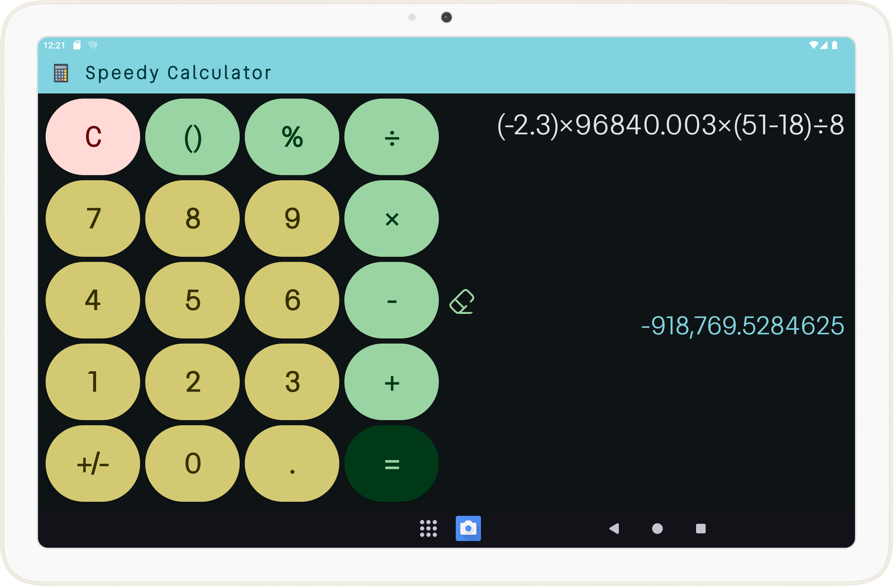

# 

Speedy Calculator

A fast and accurate calculator app with beautiful design and adaptive layout,
built as part of my Android development internship at [Oasis Infobyte](https://oasisinfobyte.com/).

## Features:

1. [X]  🎨 Beautiful design UI
2. [X]  🌙 Full support for night mode (dark theme)
3. [X]  📱 Adaptive layout (responsive in both portrait and landscape mode, and in devices of any size - providing the best user experience)
4. [X]  🔢 Accurate and deterministic
5. [X]  ⚡ Supports order of operations, decimal numbers, signed numbers, and more
6. [X]  🚀 Lightweight and fast; calculates the result instantly as you type, without having to press the equal button

## Tech Stack

- Application Logic: Kotlin
- Calculator logic: Java
- Frontend / UI: Jetpack Compose
- Design principles: Material Design

## Screenshots

### Performing a calculation in portrait mode (light theme):

### Calculator UI in portrait mode(dark theme):

### Calculator UI in landscape tablet (dark theme):

## Technical specs

- The app contains a single screen (calculator UI), and is built with Kotlin and Jetpack Compose.
- The calculation logic is implemented in Java, and uses [Shunting yard algorithm](https://en.wikipedia.org/wiki/Shunting_yard_algorithm)
  for parsing expressions, useful for order of operations (PEDMAS) and accurate results.
- Most of the possible errors are handled in the viewmodel, than the calculator class. This provides maximum
  efficiency and rejects incorrect values as they're typed. For example, it's not allowed for a number to
  have more than one decimal point.
- The UI is divided into two parts: the [keypad](app/src/main/java/com/safire/speedycalculator/ui/components/KeypadPanel.kt), and the [display panel](app/src/main/java/com/safire/speedycalculator/ui/components/DisplayPanel.kt).
- When the app is run on tablets or devices with expanded width, these components are placed horizontally, with eraser button coming in the middle.

## Credits

| Category   | Name                    | Source       |
|------------|-------------------------|--------------|
| Typography | Vend Sans font          | [Google Fonts](https://fonts.google.com/specimen/Vend+Sans?query=vend+san) |
| Drawables  | Calculator illustration | [Pixabay](https://pixabay.com/)      |

